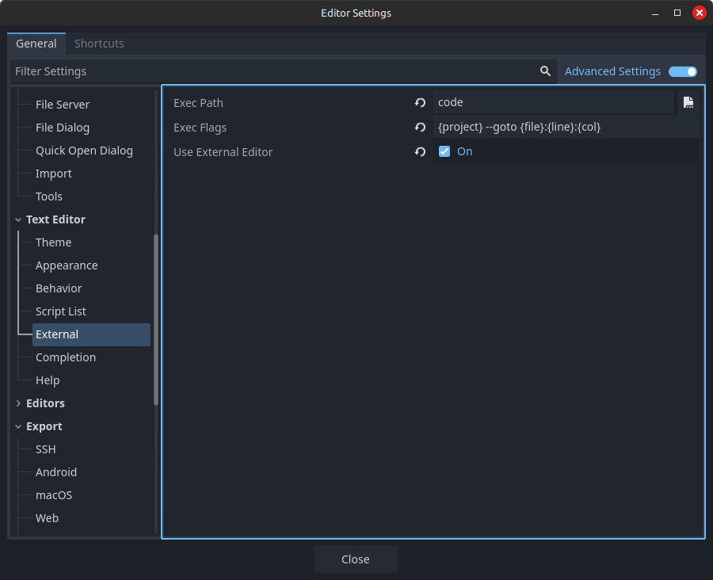
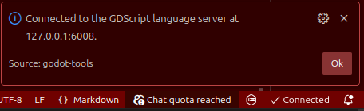

## Mod Utilizare


#### Configurare Godot Editor


Editor>Text Editor>External

```
Exec Path: code
Exec Flags: {project} --goto {file}:{line}:{col}
Use External Editor: True
```

#### Rulează folosid terminalul de GIT pentru a install extensiile
```
cat vscode-extensions.txt | xargs -n 1 code --install-extension
```

#### În fișierele din /.vscode pune calea către executabilul de Godot

```
"program": "Programs/Godot/Godot.exe"
```

#### Godot trebuie deschis primul apoi .vscode, asigurăte de conexiune, trebuie să-ți apară ca și jos. 



#### Debug

Apasă *CTRL+SHIFT+D* pentru a deschide RUN AND DEBUG' aici ai două opțiuni:
1. Debug Game -- Faci debug la toată aplicația 
2. Debug Current Scene -- Faci debug la șcena corespunzătoare fișierului .cs selectat

*CTRL + F5* pentru a rula opțiunea selectată

*CTRL + F9* pentru a pune un punct de debug F10 pentru a trece la următoarea linie din clasă F11 dacă vrei intrii întro metodă din altă clasă.
*CTRL + F5* pentru a continua.

####ATENȚIE 
Numele șcenelor create trebuie să fie identice cu numele scripturilor altfel debugger-ul nu va putea să o găsească.
